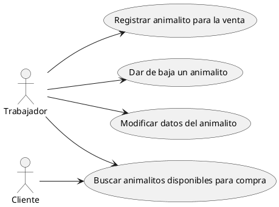

# Vocabulario:

Causa Raíz  El motivo por el que me equivocé al medir la pata de la mesa.
Error       Es una equivocacion cometida por un humano.
Defecto     Como consecuencia podemos introducir un defecto(bugs) en el software.
Fallo       Manifestación de un defecto en el software al usar el software.

Podemos arreglar un error? NO... es un evento pasado.. ya ocurrió.
Ta medí mal la pata de la mesa.
Puedo arreglar el fallo? NO... la comida ya está en el suelo. Puedo recogerla.. pero el fallo ya ocurrió.
Puedo arreglar el defecto? Quitar de mi producto ese defecto, que hasta ahora perdura en el tiempo.

Puedo analizar la causa raíz y proponer medidas que eviten nuevos errores (defectos y fallos)... trabajando sobre la causa raíz, no sobre el error, ni sobre el defecto, ni sobre el fallo.

# Tipos de pruebas

## En base al objeto de prueba:
- Pruebas funcionales
- Pruebas no funcionales
  - Pruebas de rendimiento
  - Pruebas de seguridad
  - Pruebas de usabilidad
  - Pruebas de carga
  - Pruebas de estrés
  - ...

## En base a la forma en la que se realiza la prueba:
- Pruebas dinámicas -> Las que ejecutan el software.
  Tratan de provocar FALLOS, que nos den pistas para identificar DEFECTOS. 
- Pruebas estáticas -> Las que no ejecutan el software. Revisar el código, revisar la documentación, revisar los requisitos, etc.
  Buscan DEFECTOS directamente.

## En base al conocimiento del producto 
- Caja negra -> No se conoce el código, ni la estructura interna del software. Solo se conocen los requisitos.
- Caja blanca -> Se conoce el código, la estructura interna del software. Se pueden diseñar pruebas en base a la estructura interna del software.

## En base al contexto de ejecución de la prueba
- Unitarias         Se centran en una característica de un componente AISLADO del software.
- Integración       Se centran en la COMUNICACION entre 2 compoentes del software.
- Sistema           Se centran en una característica pero del sistema completo.
  -> De aquí sale un producto ya sin defectos (o los mínimos posibles) 
- Aceptación        Se centran en la validación del software por parte del usuario final.
  -> De estas NO DEBEN SALIR DEFECTOS... solo sale la decisión del cliente: ME LO QUEDO O NO ME LO QUEDO.

# Diseño de pruebas

Una prueba tiene 3 partes:
- Contexto: El entorno en el que se va a ejecutar la prueba.
- Acción: Lo que se va a hacer en la prueba.
- Resultado esperado: Lo que se espera que ocurra al ejecutar la prueba.

Las pruebas deben respetar los principios FIRST:
- Fast: Las pruebas deben ser rápidas de ejecutar.
- Independent: Las pruebas deben ser independientes entre sí.. y con respecto a otros componentes del software (entornos...)
- Repeatable: Las pruebas deben ser repetibles, es decir, deben dar el mismo resultado cada vez que se ejecuten.
- Self-validating: Las pruebas deben ser auto-validantes, es decir, deben ser capaces de validar su propio resultado.
- Timely: Las pruebas deben ser diseñadas y ejecutadas en el momento adecuado del ciclo de desarrollo del software.

Estos principios, de respetarlos, nos ayudarán a tener un buen diseño de pruebas, que nos permita detectar defectos de manera eficiente y efectiva... y a hacer pruebas más mantenibles en el tiempo.

---

# Microservicio que me permita un CRUD de animalitos.

                                                        Microservicio
    http -->                                        +--------------------+
        GET                                         |    PROGRAMA???     |
        POST                                        +--------------------+
        DELETE
        PUT

## Casos de uso / Actores

    ACTORES                                    CASOS DE USO

ACTOR 1: Trabajador de la tienda -------------- Registrar animalito para la venta                                                   C
                                 \_____________ Dar de baja un animalito (porque ya no lo vendo... o lo vendí... o lo he regalao).  D
                                  \____________ Modificar datos del animalito                                                       U
ACTOR 2: Clientes _________________\___________ Buscar animalitos disponibles para compra                                           R

Hemos dibujado un diagrama de casos de uso (UML... estandar ISO para hacer dibujos).




## Requisitos

### Caso de uso 1: Registrar animalito para la venta

#### Escenario 1: Registrar un nuevo animalito del que conozco todos sus datos.. y son datos GUAYS = HAPPY PATH

DADO:
- Los datos de un animalito guays:
    - Nombre: Rocky
    - Especie: Perro
    - Raza: Labrador
    - Edad: 2 años
    - Peso: 20 kg
    - Nº Identificación: XXXXXXX
    - Observaciones: Es un perro muy juguetón y cariñoso.

CUANDO:
- Un trabajador haga una petición http de tipo POST al endpoint /api/v1/animalitos 
  mandando en el cuerpo de la petición un json con los datos del animalito guays:
    ```json
    {
        "nombre": "Rocky",
        "especie": "Perro",
        "raza": "Labrador",
        "edad": 5,
        "peso": 20,
        "numeroIdentificacion": "XXXXXXX",
        "observaciones": "Es un perro muy juguetón y cariñoso."
    }
    ```
ENTONCES:
- Código de respuesta HTTP: 201 Created
- Se da de alta un registro en una BBDD donde vamos a hacer acopio de los animalitos.
  Se guardarán en ese registro todos los datos del animalito guays.
  Y además, se le asignará un ID único a ese animalito, que se generará automáticamente.
- En el cuerpo de la respuesta se devuelve un json con los datos del animalito guays, incluyendo el ID único que se le ha asignado:
    ```json
    {
        "id": "ABCD-1234-EFGH-5678",
        "nombre": "Rocky",
        "especie": "Perro",
        "raza": "Labrador",
        "edad": 5,
        "peso": 20,
        "numeroIdentificacion": "XXXXXXX",
        "observaciones": "Es un perro muy juguetón y cariñoso.",
        "fecha_alta": "2024-06-01T12:00:00Z",
        "fecha_de_ultima_modificacion": "2024-06-01T12:00:00Z",
        "creador": "Juan Pérez"
    }
    ```
- Mandar una notificación de alta (SMS, Whatspp, notifiacion a un canal de Teams) a un sistema de mensajería:
  - Kafka, RabbitMQ, ActiveMQ, etc.
  - Con un mensaje que contenga el mismo json que se ha devuelto en el cuerpo de la respuesta.
    - Qué se hará con esto? ME LA PELA! No es mi problema. Será problema del tio/a que esté montando el sistema de notificaciones.

#### Escenario 2: Registrar un nuevo animalito del que no conozco el Nombre, peso, edad,numero de identificación u observaciones

DADO:
- Los datos de un animalito guays:
    - Nombre: NO LO TENGO
    - Especie: Perro
    - Raza: Labrador
    - Edad: NO LO TENGO
    - Peso: NO LO TENGO
    - Nº Identificación: NO LO TENGO
    - Observaciones: NO LO TENGO

CUANDO:
- Un trabajador haga una petición http de tipo POST al endpoint /api/v1/animalitos 
  mandando en el cuerpo de la petición un json con los datos del animalito guays:
    ```json
    {
        "especie": "Perro",
        "raza": "Labrador"
    }
    ```
ENTONCES:
- Código de respuesta HTTP: 201 Created
- Se da de alta un registro en una BBDD donde vamos a hacer acopio de los animalitos.
  Se guardarán en ese registro todos los datos del animalito guays.
  Y además, se le asignará un ID único a ese animalito, que se generará automáticamente.
- En el cuerpo de la respuesta se devuelve un json con los datos del animalito guays, incluyendo el ID único que se le ha asignado:
    ```json
    {
        "id": "ABCD-1234-EFGH-5678",
        "especie": "Perro",
        "raza": "Labrador",
        "fecha_alta": "2024-06-01T12:00:00Z",
        "fecha_de_ultima_modificacion": "2024-06-01T12:00:00Z",
        "creador": "Juan Pérez"
    }
    ```
- Mandar una notificación de alta (SMS, Whatspp, notifiacion a un canal de Teams) a un sistema de mensajería:
  - Kafka, RabbitMQ, ActiveMQ, etc.
  - Con un mensaje que contenga el mismo json que se ha devuelto en el cuerpo de la respuesta.
    - Qué se hará con esto? ME LA PELA! No es mi problema. Será problema del tio/a que esté montando el sistema de notificaciones.

#### Escenario 3: Registrar un nuevo animalito con nombre CHUNGO

DADO:
- Los datos de un animalito guays:
    - Nombre: 33, "XXXXXXXXXXXXXXXXXXXXXXXXXXXXXXXXXXXXXXXXXXXXXXXXXXXXXX", "X", "#&&/()@"
    - Especie: Perro
    - Raza: Labrador
    - Edad: 2 años
    - Peso: 20 kg
    - Nº Identificación: XXXXXXX
    - Observaciones: Es un perro muy juguetón y cariñoso.

CUANDO:
- Un trabajador haga una petición http de tipo POST al endpoint /api/v1/animalitos 
  mandando en el cuerpo de la petición un json con los datos del animalito guays:
    ```json
    {
        "nombre": "33",             \"XXXXXXXXXXXXXXXXXXXXXXXXXXXXXXXXXXXXXXXXXXXXXXXXXXXXXX\", \"X\", \"#&&/()@\"",
        "especie": "Perro",
        "raza": "Labrador",
        "edad": 5,
        "peso": 20,
        "numeroIdentificacion": "XXXXXXX",
        "observaciones": "Es un perro muy juguetón y cariñoso."
    }
    ```
ENTONCES:
- Código de respuesta HTTP: 400 Bad Request
- En el cuerpo de la respuesta se devuelve un json con los datos del animalito guays, incluyendo el ID único que se le ha asignado:
    ```json
    {
        "source": {
            "nombre": "33",             \"XXXXXXXXXXXXXXXXXXXXXXXXXXXXXXXXXXXXXXXXXXXXXXXXXXXXXX\", \"X\", \"#&&/()@\"",
            "especie": "Perro",
            "raza": "Labrador",
            "edad": 5,
            "peso": 20,
            "numeroIdentificacion": "XXXXXXX",
            "observaciones": "Es un perro muy juguetón y cariñoso."
        },
        "status":"ERROR",
        "details": [
            {
                "message": "El nombre del animalito no es válido. Debe ser un texto con letras mayúsculas y minúsculas, sin caracteres especiales ni números, y con una longitud entre 1 y 50 caracteres.",
                "targetField": "nombre"
            }
        ]
    }
    ```
# Escenario 4: Edad mayor o igual 0

# Escenario 5: Peso mayor 0

# Y así con todos los campos

# Cuantas pruebas me van a salir para este caso de uso? Más de 20 o 30

# Cuando estas pruebas las automaticemos... que de eso va este curso!

Si el código son 200 lineas. Facil tendré unas 2000 lineas de código de pruebas.
Un ratio 1-10 en tests es habitual.

Y por supuesto, no me da pereza... tardo mucho menos en hacer las pruebas que en no hacerlas... en el medio plazo.

---

Hay muchos principio que aplicamos en el mundo del software... que nos ayudan a crear buen código:
- SoC: Separation of Concerns -> Separación de preocupaciones.
  Djiskra: Pronunció un discurso cuando le dieron el premio Turing (197?): "The humble programmer"
  Decía que un buen programador ante todo debe ser humilde... y entender y aceptar las limitaciones de su cerebro.
  Decía que cuando estamos en un tema, debemos olvidarnos del resto de temas... y centrarnos solo en ese tema... porque nuestro cerebro no es capaz de gestionar muchas cosas a la vez.
- SOLID

# Diseño/Arquitectura del microservicio

                                            --------------------------------------- BACK END -----------------------------------------------------------------------

                                                                            APLICACIÓN (Microservicio)

                                                                AnimalitosRestControllerV1    AnimalitosService          AnimalitosRepository
Cliente   --> Envío JSON                --> Servidor APP WEB ->   Controlador                   Servicio                  Repositorio                    BBDD 
              POST /api/v1/animalitos            Tomcat                                                                                           Garantizar el dato
              Registrar un animalito           Ejecutar App                                      registrarAnimalito()
                           
                                                                Exponer la funcionalidad           Lógica de negocio      Persistencia de datos
                                                                del servicio                        Validar datos
                                                                mediante un protocolo               Solicitar persistencia en BBDD
                                                                                                    Mandar notificación a un sistema de mensajería
                                                                                                    Devolver la información completa del animalito registrado, incluyendo el ID único que se le ha asignado.
    FRONTAL Web (Navegador)                                                                                                   
------------------------------------
    Formulario     ->     Servicio ----->

    Capturar datos        Comunicaciones  
    del animalito         con un backend

    VALIDACION DE CORTESIA

FRONTAL 2
    App Android     -> Servicio

FRONTAL 3
    App iOS         -> Servicio

Peso > 0 ---> IF en el código       ESTO NO SON REGLAS DE NEGOCIO
Edad >= 0

    La bbdd es la garante del dato. No puede permitir que entre un dato podrido!
    Y si el día de mañana me hacen una carga masiva de datos a la BBDD? con un script SQL..

Edad >= 6 meses                   Decisión de negocio (esto no va en BBDD), esto va en el servicio de backend.
    Una edad de 3 meses es un dato válido
    Pero no aceptable en nuestro negocio.
    Una edad de -5 meses no es un dato válido, ni aceptable en nuestro negocio, ni en ningún negocio. No es una edad.
    Igual que MENCHU no es una FECHA... y la BBDD en el campo FechaDeNacimiento, sio escribo MENCHU me pedga una hostia a todos los morros!
    Y como me va a dejar meter -5 en peso? que lógica sigue esto que no sigue lo de la fecha! Qué criterio! NINGUNO. ES UN SIN SENTIDO!
    Ahora... 1-1-2027 es una fecha válida, pero no admito fechas de nacimiento futuras. en mi negocio... en otros negocios quizás si..
    Hay aseguradoras que permiten asegurar a un bebe no ancido aún... 

Hace 20 años lo que montaba en backend era un MONOLITO en jsp, asp, php, etc...
Y el jsp, asp, php, etc... era el controlador, el servicio y el repositorio a la vez... todo mezclado en un mismo archivo... con código de presentación, código de negocio y código de acceso a datos todo mezclado... un desastre. HASTA GENERABA HTML!

Hace 20 años, el formulario:
<form action="/RegistrarAnimalito" method="post">
    <input type="text" name="nombre" placeholder="Nombre del animalito">
    <input type="text" name="especie" placeholder="Especie del animalito">
    <input type="text" name="raza" placeholder="Raza del animalito">
    <input type="number" name="edad" placeholder="Edad del animalito">
    <input type="number" name="peso" placeholder="Peso del animalito">
    <input type="text" name="numeroIdentificacion" placeholder="Número de identificación del animalito">
    <textarea name="observaciones" placeholder="Observaciones sobre el animalito"></textarea>
    <button type="submit">Registrar animalito</button>

Esto ya no se hace. (Para eso usamos componentes web, y arquitecturas de componentes desacoplados también en el frontal): REACT, Angular, Vue...

Hace muchos años que no trabajamos asi. Esos sistemas son inmantenibles. Ya no consumimos MONOLITOS... ahora montamos ARQUITECTURAS DE COMPONENTES DESACOPLADOS.
Y a esos componentes es a los que tiene sentido hacerles pruebas unitarias... pruebas de integración... etc.

CADA PIEZA tiene una razón de ser... asume una responsabilidad... 
Cuando añado una funcionalidad he de entender bien dónde la añado.


LAS COSAS EVOLUCIONAN EN EL TIEMPO.

Herramientas, lenguajes, arquitecturas,                      patrones,                    diseños,          metodologías         culturas.
    git         java 17     de componentes desacoplados     inyección de dependencias      SOLID                TDD             DevOps
    mvn     spring boot 3.0                                                                                     agile

Herramientas, lenguajes, arquitecturas,                      patrones,                    diseños,          metodologías         culturas.
    subversion   java 8     monolitico                   singleton                                           waterfall


Si saco una pieza y la meto en otro ecosistema ... NO ENCAJA!


---


    AnimalitosService - Lógica de Negocio
      - registrarAnimalito
        - Validar datos del animalito guays:
          - Nombre: No contener caracteres especiales, ni números, ni tener una longitud menor a 1 o mayor a 50 caracteres.
        - AnimalitorRepository.guardarAnimalitoEnBBDD
        - SistemaDeMensajeriaService.mandarNotificacion
      - darDeBajaAnimalito
      - modificarDatosAnimalito
      - listarTodosLosAnimalitos

    Un AnimalitosRepository es alguien que me permite persistir animalitos en una BBDD                                      INTERFAZ
        - guardarAnimalitoEnBBDD 
        - borrarAnimalitoDeBBDD
        - actualizarAnimalitoEnBBDD
        - listarTodosLosAnimalitosDeBBDD

        Quizás luego tenga un AnimalitosRepositoryMongo                                                                     CLASES
        Quizás luego tenga un AnimalitosRepositoryMySQL
        Todos ellos son implementaciones concretas de un AnimalitosRepository.
        Es decir, todos ellos deben tener funciones del tipo: guardarAnimalitoEnBBDD, borrarAnimalitoDeBBDD, actualizarAnimalitoEnBBDD, listarTodosLosAnimalitosDeBBDD... 
            pero cada uno de ellos tendrá su propia implementación de esas funciones, adaptada a la tecnología de BBDD que esté usando. 

    SistemaDeMensajeriaService
        - mandarNotificacion 


```java
public interface DatosDeAltaDeUnAnimalito {
    String getNombre();
    String getEspecie();
    String getRaza();
    int getEdad();
    int getPeso();
    String getNumeroIdentificacion();
    String getObservaciones();
}
public interface DatosCompletosDeUnAnimalito extends DatosDeAltaDeUnAnimalito {
    String getId();
    String getFechaAlta();
    String getFechaDeUltimaModificacion();
}
public interface AnimalitosRepository {                                 // ESPECIFICACION DE UNA RUEDA
                                                                        // Quiero una rueda de 2 pulgadas de ancho y de 16 pulgadas de diámetro.
                                                                        // Con neumáticos de montaña.
                                                                        // HABRA RUEDAS que cumplan con esta especificación... y otras que no la cumplan.
                                                                            // Michelín XJ-2 16x2
                                                                            // Pirelli MT-3 16x2
    DatosCompletosDeUnAnimalito guardarAnimalitoEnBBDD(DatosDeAltaDeUnAnimalito animalito);
    void borrarAnimalitoDeBBDD(String id);
    void actualizarAnimalitoEnBBDD(String id, DatosDeAltaDeUnAnimalito animalito);
    List<DatosDeAltaDeUnAnimalito> listarTodosLosAnimalitosDeBBDD();
}
public interface SistemaDeMensajeriaService {
    void mandarNotificacion(DatosDeAltaDeUnAnimalito animalito);
}
public class SistemaDeMensajeriaKafka implements SistemaDeMensajeriaService {
    @Override
    public void mandarNotificacion(DatosDeAltaDeUnAnimalito animalito) {
        // Implementación concreta para mandar una notificación a un sistema de mensajería Kafka
    }
}
public class AnimalitosService {                                        // Sistema de frenos
    private AnimalitosRepository animalitosRepository;
    private SistemaDeMensajeriaService sistemaDeMensajeriaService;

    public AnimalitosService(AnimalitosRepository animalitosRepository, SistemaDeMensajeriaService sistemaDeMensajeriaService) {
        this.animalitosRepository = animalitosRepository;
        this.sistemaDeMensajeriaService = sistemaDeMensajeriaService;
    }
    //Con este cambio, nuestro AnimalitosService ya no depende de una implementación concreta de AnimalitosRepository ni de SistemaDeMensajeriaService, sino que depende de las interfaces. Esto nos permite cambiar las implementaciones concretas sin tener que modificar el código del servicio, lo que hace que nuestro código sea más flexible y mantenible.

    public DatosCompletosDeUnAnimalito registrarAnimalito(DatosDeAltaDeUnAnimalito animalito) {
        // Validar datos del animalito guays:
        if (!validarNombre(animalito.getNombre())) {
            throw new IllegalArgumentException("El nombre del animalito no es válido. Debe ser un texto con letras mayúsculas y minúsculas, sin caracteres especiales ni números, y con una longitud entre 1 y 50 caracteres.");
        }
        // Guardar el animalito en la BBDD y capturado los datos completos del animalito guardado, incluyendo el ID único generado automáticamente.
        DatosCompletosDeUnAnimalito animalitoGuardado = animalitosRepository.guardarAnimalitoEnBBDD(animalito);
        // Mandar notificación de alta a un sistema de mensajería
        sistemaDeMensajeriaService.mandarNotificacion(animalito);
        return animalitoGuardado;
    }

    private boolean validarNombre(String nombre) {
        if (nombre != null && (nombre.length() <= 1 || nombre.length() > 50)) {
            return false;
        }
        for (char c : nombre.toCharArray()) {
            if (!Character.isLetter(c) && !Character.isWhitespace(c)) {
                return false;
            }
        }
        return true;
    }

}
```

```java
// Este es mi vastidor... en el que apoyar el AnimalitosService...
// 4 hierros mal soldaos...
// Esto es un AnimalitosRepository de verdad? NO lo es...
// Coño, ni un bastidor es una bicicleta
// Pero para la prueba que quiero hacer, me hace las veces.
// Confío en este bastidor? en esta clase? Esta clase puede fallar cuando se ejecute?
// No hay probabilidad que falle.. No hace nada... más que devolver 4 valores fijos.
// Me sirve para hacer la prueba. YA NO DEPENDO DEL ANIMALITOSREPOSITORY DE VERDAD DE LA BUENA... tengo un simulacro de AnimalitosRepository... 4 hierros mal soldaos.
// Si uso este en vez del bueno, AISLO al componente AnimalitosServicio del AnimalitosRepositoryDeVerdad... le pongo a trabajar sobre un bastidor... que me lo sujeta mientras hago la prueba.
public class AnimalitosRepositoryDeMentirijilla implements AnimalitosRepository {
    @Override
    public DatosCompletosDeUnAnimalito guardarAnimalitoEnBBDD(DatosDeAltaDeUnAnimalito animalito) {
        // Simulación de guardar el animalito en la BBDD y devolver los datos completos del animalito guardado, incluyendo el ID único generado automáticamente.
        return new DatosCompletosDeUnAnimalito() {
            @Override
            public String getId() {
                return "ABCD-1234-EFGH-5678";
            }
            @Override
            public String getNombre() {
                return animalito.getNombre();
            }
            @Override
            public String getEspecie() {
                return animalito.getEspecie();
            }
            @Override
            public String getRaza() {
                return animalito.getRaza();
            }
            @Override
            public int getEdad() {
                return animalito.getEdad();
            }
            @Override
            public int getPeso() {
                return animalito.getPeso();
            }
            @Override
            public String getNumeroIdentificacion() {
                return animalito.getNumeroIdentificacion();
            }
            @Override
            public String getObservaciones() {
                return animalito.getObservaciones();
            }
            @Override
            public String getFechaAlta() {
                return new Date().toString();
            }
            @Override
            public String getFechaDeUltimaModificacion() {
                return new Date().toString();
            }
        };
    }

}
public class SistemaDeMensajeriaDeMentirijilla implements SistemaDeMensajeriaService { // Spy

    private DatosDeAltaDeUnAnimalito datosDelAnimalitoConLosQueMeLlamaron = null;

    @Override
    public void mandarNotificacion(DatosDeAltaDeUnAnimalito animalito) {
        // No hago nada... pero ya tengo una función que puede ser invocada... y no explota
        datosDelAnimalitoConLosQueMeLlamaron = animalito;
    }

    public boolean teHanLlamao() {
        return datosDelAnimalitoConLosQueMeLlamaron != null;
    }
    public DatosDeAltaDeUnAnimalito conQueDatosTeHanLlamdo() {
        return datosDelAnimalitoConLosQueMeLlamaron;
}
public class SistemaDeMensajeriaDeMentirijilla2 implements SistemaDeMensajeriaService { // Mock
// Un mock es más sofisticado que un espia. Le dioho a priori los datos con los que deben llamarle. Si le llaman con otros, el propio Mock Explota

    private DatosDeAltaDeUnAnimalito datosDelAnimalitoConLosQueTeLlamarán = null;
    private boolean teHanLlamao = false;

    @Override
    public void mandarNotificacion(DatosDeAltaDeUnAnimalito animalito) {
        if (datosDelAnimalitoConLosQueTeLlamarán == null) {
            throw new IllegalStateException("No se han configurado los datos con los que se espera que se llame a este método.");
        }
        if (!datosDelAnimalitoConLosQueTeLlamarán.equals(animalito)) {
            throw new IllegalArgumentException("Los datos con los que se ha llamado a este método no coinciden con los datos configurados.");
        }
        teHanLlamao = true;
    }

    public boolean teHanLlamao() {
        return teHanLlamao;
    }
    public void set oyeTeLlamaránConEstosDatos(DatosDeAltaDeUnAnimalito datosDelAnimalitoConLosQueTeLlamarán) {
        this.datosDelAnimalitoConLosQueTeLlamarán = datosDelAnimalitoConLosQueTeLlamarán;
    }
}
```
Tengo que crear esta clase para poder hacer la prueba unitaria del AnimalitosService? SI
Igual que para hacer la prueba unitaria del sistema de frenos, necesito un bastidor y un sensor.
Es que no hay dinero.. para dedicar tiempo a escribir esto...
Bueno.. haberlo presupuestado! es tu problema!

NOTA: En la práctica, usamos librerías como MOCKITO, que nos ayudan a crear estas clases rápido... sin necesidad de escribirlas nosotros.

Lo que hemos montado es o que se llama un STUB. Es una implemntación de una clase que devuelve valores fijos... que me sirven para hacer la prueba de otro componente... en este caso, del AnimalitosService.


---

# Definamos la prueba para el happy path de la función registrarAnimalito del AnimalitosService

DADO:
Que tengo un AnimalitosService, con un AnimalitosRepositoryDeMentirijilla y un SistemaDeMensajeriaDeMentirijilla.
> SistemaDeMensajeriaDeMentirijilla sistemaDeMensajeriaDeMentirijilla = new SistemaDeMensajeriaDeMentirijilla();
> AnimalitosService animalitosService = new AnimalitosService(new AnimalitosRepositoryDeMentirijilla(), sistemaDeMensajeriaDeMentirijilla);

Y dado que tengo un animalito guays con los siguientes datos:
    - Nombre: Rocky
    - Especie: Perro
    - Raza: Labrador
    - Edad: 2 años
    - Peso: 20 kg
    - Nº Identificación: XXXXXXX
    - Observaciones: Es un perro muy juguetón y cariñoso.

> DatosDeAltaDeUnAnimalito animalitoGuays = new DatosDeAltaDeUnAnimalito("Rocky", "Perro", "Labrador", 2, 20, "XXXXXXX", "Es un perro muy juguetón y cariñoso.");
> sistemaDeMensajeriaDeMentirijilla.oyeTeLlamaránConEstosDatos(animalitoGuays);
CUANDO:
    Llamo a la función registrarAnimalito del AnimalitosService, pasando el animalito guays como parámetro.

> DatosCompletosDeUnAnimalito animalitoRegistrado = animalitosService.registrarAnimalito(animalitoGuays);

ENTONCES:
    - Se devuelve un objeto con los datos completos del animalito registrado, incluyendo :
      - ID: ABCD-1234-EFGH-5678
      - Fecha de alta: Fecha actual
      - Fecha de última modificación: Fecha actual

> assertEquals("ABCD-1234-EFGH-5678", animalitoRegistrado.getId());
> assertNotNull(animalitoRegistrado.getFechaAlta());
> assertNotNull(animalitoRegistrado.getFechaDeUltimaModificacion());
> assertEquals(new Date().toString(), animalitoRegistrado.getFechaAlta());
> assertEquals(new Date().toString(), animalitoRegistrado.getFechaDeUltimaModificacion());
> assertEquals("Rocky", animalitoRegistrado.getNombre());
> assertEquals("Perro", animalitoRegistrado.getEspecie());
> assertEquals("Labrador", animalitoRegistrado.getRaza());
> assertEquals(2, animalitoRegistrado.getEdad());
> assertEquals(20, animalitoRegistrado.getPeso());
> assertEquals("XXXXXXX", animalitoRegistrado.getNumeroIdentificacion());
> assertEquals("Es un perro muy juguetón y cariñoso.", animalitoRegistrado.getObservaciones());
>
> Y se ha mandado una notificación de alta a un sistema de mensajería.
> assertTrue(sistemaDeMensajeriaDeMentirijilla.teHanLlamao());
//> assertEquals(animalitoGuays, sistemaDeMensajeriaDeMentirijilla.conQueDatosTeHanLlamdo());

HE AUTOMATIZADO LA PRUEBA UNITARIA... con ayuda de mis trastos de mentirijilla.
No necesitaba un AnimalitosRepository de verdad... ni un SistemaDeMensajeria de verdad... para hacer esta prueba unitaria del AnimalitosService.

Esta prueba no es self-validating... 

Hay cosas que no está probando.

Los mocks nos dan mucho juego... porque son reutilizables... entre pruebas.
En cada prueba, configuro el mock con los datos con los que espero que le llamen.. en esa prueba concreta.

Tanto dummies, como mocks, como stubs, como spies, los podemos crear facilemnte con librerias como Mockito.

Hay otro tipo de test-double: FAKE

No montamos Fakes con mockito.

Un FAKE es una implementación REAL, pero con poca probabilidad de error.

Por ejemplo... una BBDD de verdad MySQL o Postgres... puede no arrancar.. puede no estar disponible... puede tener un error de configuración... etc... y entonces, la prueba que dependa de esa BBDD, fallará... no porque el código que estoy probando tenga un defecto... sino porque la BBDD de verdad ha fallado.

Puedo usar una BBDD embebida en Memoria RAM.. sin soporte a Disco Duro.. sin persistencia REAL de la información: SQLLite, H2
Esas BBDD no fallan. no tienen problemas de permisos... i tengo problemas de conectividad...

En la industria del software encontramos fakes de muchos componentes estandar:
- Fakes de BBDD: SQLLite, H2, etc.
- Fakes de sistemas de mensajería: Embedded Kafka, Embedded RabbitMQ, etc.
- Fakes de servicios web: WireMock, MockServer, etc.
- Fakes de servicios REST: JSON Server, etc.

--- 
Tratar de hacer una prueba: Queremos probar la funcion recuperarDatosDeUnAnimalito(ID) del AnimalitosService.
Una prueba Unitaria

DADO

CUANDO

ENTONCES
